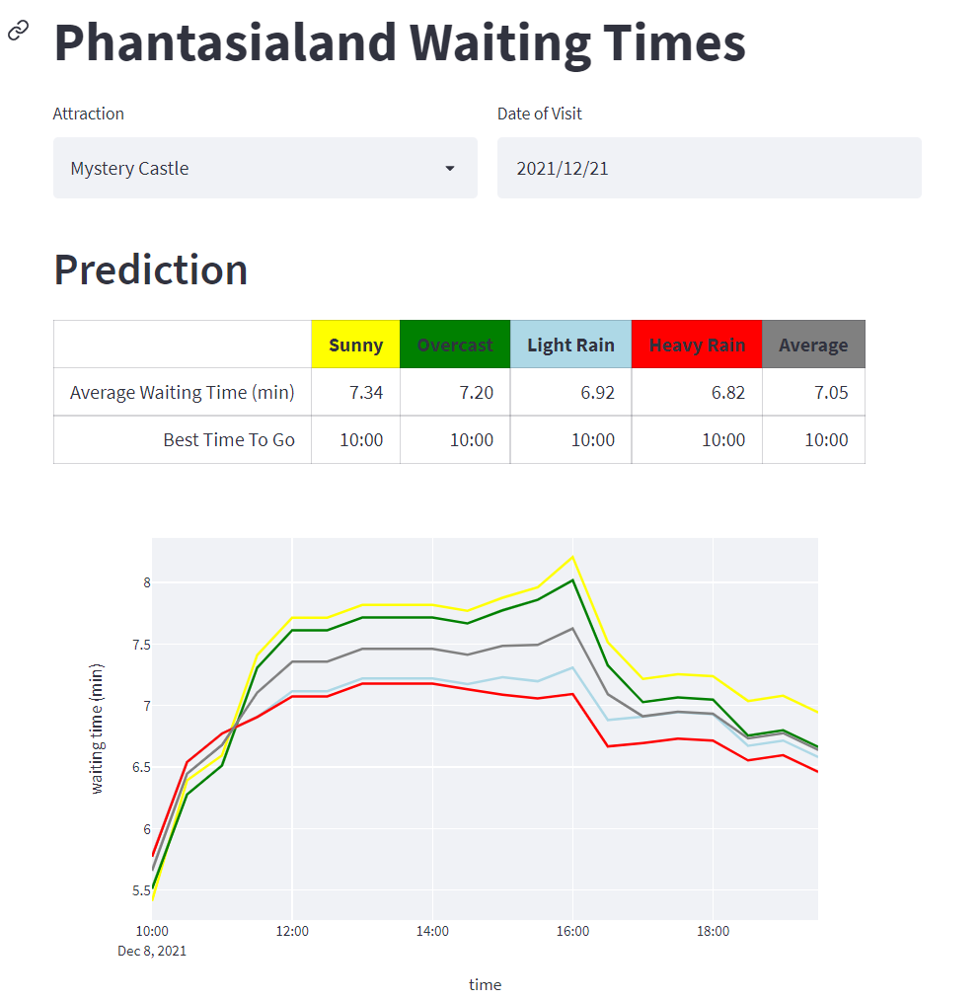

Phantasialand Waiting Times
==============================

This is a machine learning project focussed on creating and serving a machine learning
model to predict future waiting times in the
[Phantasialand](https://www.phantasialand.de/de/) amusement park. 

To this end, waiting time data from
[wartezeiten.app](https://www.wartezeiten.app/phantasialand/), weather data from the
[Deutscher Wetterdienst](https://www.dwd.de/) and data about German public and school
holidays were analyzed and used to train different machine learning models ([Linear
Regression](https://scikit-learn.org/),
[XGBoost](https://xgboost.readthedocs.io/en/stable/) and
[LightGBM](https://github.com/microsoft/LightGBM)). We tuned the hyperparameters of the
best model (it was LightGBM) and serve it as a WebApp using
[Streamlit](https://streamlit.io/).

This is how the interface looks like:



You can learn more about this project on our blog: [CI
Insights](https://www.cologne-intelligence.de/blog) (German).

This repository comes without the data and the trained models. In order to reproduce our
results, you will have to download the data and train the models by yourself.

Installation
------------


Setup a virtual environment and install all project dependencies. Python 3.8 or higher 
is required.

```bash
> python3 -m venv .venv/
> source .venv/bin/activate
> pip install -r requirements_dev.txt
```

Data Retrieval
--------------

Unfortunately, most of the data retrieval must be done by hand.

### Weather Data

1. Download `tageswerte_KL_01327_19370101_20201231_hist.zip` and
   `tageswerte_KL_02667_19570701_20201231_hist.zip` from [OpenData.DWD -
   Historical](https://opendata.dwd.de/climate_environment/CDC/observations_germany/climate/daily/kl/historical/)
2. Download `tageswerte_KL_01327_akt.zip` and `tageswerte_KL_02667_akt.zip` from
   [OpenData.DWD -
   Recent](https://opendata.dwd.de/climate_environment/CDC/observations_germany/climate/daily/kl/recent/)
3. Place all four files in `data/raw/dwd_weather`

### Holiday Data
1. Download the iCal calendar file containing all German public holidays from
   [https://www.feiertage-deutschland.de/kalender-download/](https://www.feiertage-deutschland.de/kalender-download/)
   and save it as `Feiertage Deutschland.ics`
2. Copy and paste the tables with school holiday information for 2019-2024 from
   [https://www.schulferien.org/deutschland/ferien/](https://www.schulferien.org/deutschland/ferien/)
   and save them as `schulferien.txt`. Look at `data/raw/schulferien_template.txt` for
   the file structure.
3. Place both files in `data/raw/`

### Waiting Time Data

Activate the virtual environment and run 

```bash
> python src/data/download_waiting_times.py data/raw/wartezeiten_app.csv
```

This will download all waiting time data from
[https://www.wartezeiten.app/phantasialand/](https://www.wartezeiten.app/phantasialand/)
and may take a moment. 

Data Processing and Model Training
----------------------------------

Make sure that `data/raw` looks like this:

```
data/raw
├── Feiertage Deutschland.ics
├── dwd_weather
│   ├── tageswerte_KL_01327_19370101_20201231_hist.zip
│   ├── tageswerte_KL_01327_akt.zip
│   ├── tageswerte_KL_02667_19570701_20201231_hist.zip
│   └── tageswerte_KL_02667_akt.zip
├── schulferien.txt
├── sources.md
├── wartezeiten_app.csv
```

Run

```bash
> make data
```

to process the raw data and 

```bash
> python src/training/train_lightgbm.py
```

to train the LightGBM model.

You may also have a look at the other training scripts in `src/training` or play with
the parameters. All models that are trained with this scripts are saved using the MLflow
model registry.

Streamlit WebApp
----------------

If you want to use the web app, you need to copy the desired model from the MLflow model
registry to `models/best/`. The models trained and saved with MLflow are placed at 
`mlruns/0/<some hash>/artifacts/model`. Make sure to copy all files in this folder 
(especially `MLmodel` and `model.pkl`). 

If you trained only one model, it should be easy to see which model you want to copy. 
Otherwise use the MLflow UI (`mlflow ui --backend-store-uri sqlite:///mlflow.db`) to 
find the path to your favorite model.

Afterwards you can open the WebApp with

```bash
> streamlit run src/app/app.py
```

Deployment
----------

You can deploy the web app including the model used for prediction as Docker container.

Follow this steps:

1. Ensure that you have docker installed and `dockerd` is running
2. Ensure that you ran `make data` and placed your favorite model in `models/best/`
3. If you want to deploy the container via Heroku, follow [this
   guide](https://devcenter.heroku.com/articles/container-registry-and-runtime) and
   build the container using `heroku container:push -R`. This will use the
   `Dockerfile.web` file, which is optimized for Heroku.
4. Otherwise run `docker build -t phantasialand:latest .` to build the container. This
   will use the `Dockerfile` file, which exposes the WebApp on a fixed port (8501).

Data Analysis and Evaluation
----------------------------

If you want to perform some data analyses or model evaluations, you may want to have a
look at the notebooks in `notebooks/`. 

**End-to-End-Analysis:** Note that the models are trained on exact weather data whereas
users can only see weather bins (like sunny, overcast, light rain, heavy rain) as we
do not have future weather data. This causes a bias in evaluation. To get realistic
evaluation results, you can use `src/evaluation/test_e2e.py`. It transforms the exact
weather data into weather bins before querying the model. The scripts generates a csv
file containing predictions and actual values for all samples in the test set which can
then be analyzed, e.g. by using one of the `notebooks/evaluation/fm_e2e_xxx` notebooks.
